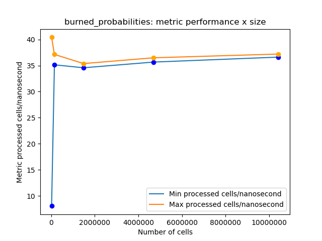
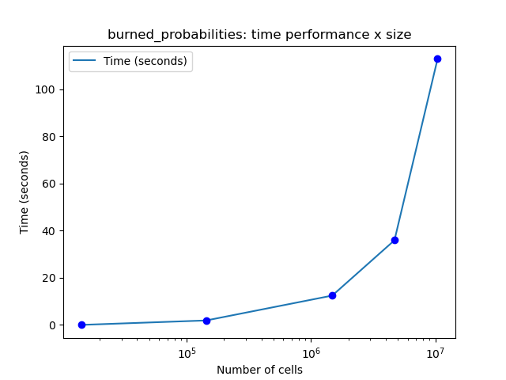

# Informe I

__Laboratorio__: fire_spread

__Integrantes__: Arroyo Joaquin y Bolzan Francisco

## Notas

Realizamos la optimización sobre la simuluación __burned_probabilities__.

## Métricas

__Celdas procesadas x nanosegundo__: Es escalable para diferentes tamaños de simulación y mayor valor indica mejor rendimiento.

__Porcentaje de _cache-hits___: Mide la frecuencia con la que los accesos a memoria cache son exitosos.

Para el cálculo de la primer métrica, contamos cada celda procesada por cada simulación y el tiempo que tardó, luego calculamos la métrica como ```processed_cells / (seconds * 1e7)``` y nos quedamos con el valor mínimo y máximo.

Para la otra métrica, utilizamos ```perf stat```.

## Optimización en g++

Tomamos un caso en particular de tamaño intermedio sobre el que aplicamos las siguientes optimizaciones:

```
-O1 + ffast-math -funroll-loops -fprefetch-loop-arrays -fstore-merging -freorder-functions
```

- __O1__: Bandera de múltiples mejoras que presenta mayor eficiencia.
- __fast-math__: Optimiza operaciones flotantes, impacto alto porque tenemos muchas operaciones con doubles.
- __unroll-loops__: Aplana loops en lo posible, impacto alto porque nuestros loops tienen condiciones predecibles.
- __prefetch-loop-arrays__: Precarga datos aser usados en loops, impacto medio porque nuestra estructura ppal es un arreglo que no entra en L1, L2.
- __store-merging__: Hace más eficiente el acceso a estructuras largas almacenadas, impacto medio porque nuestra estructura ppal es grande pero de ítems pequeños.
- __reorder-functions__: Reordena el código en memoria según su utilización, impacto medio porque condensa juntas las partes del código con mayor acceso a memoria.
- Quitamos __-march=native__ ya que las heurísticas que utiliza a veces chocan con aquellas de las otras banderas elegidas.
- Probamos las siguientes banderas sin notar mejora significativa: __-O2 -O3 -finline-functions -fhoist-adjacent-loads -mavx2 -mfma -funsafe-math-optimizations__.

## Optimización en código

Utilizando ```perf report``` vimos que en la comparación para ver si una celda se incendiaba o no, se realizaba una división de doubles lo cuál no es óptimo, por lo que modificamos el código de la siguiente manera:

```
Código previo:
bool burn = (double)rand() / (double)RAND_MAX < prob;

Código actual:
bool burn = rand() < prob * (RAND_MAX + 1.0);
```

Luego de esto, notamos una pequeña mejora en el tiempo de ejecución y en las métricas analizadas.

## Otros compiladores


### icpx

Notamos que sin optimizaciones explícitas, icpx tuvo mejor rendimiento que g++, esto se da debido a que el primer compilador ya realiza optimizaciones de base.  A medida que agregamos banderas esta diferencia pasó a estar a favor de g++.

### clang

No logramos hacer funcionar las librerías para compilar el programa.

## Resultados

Estos resultados fueron obtenidos sobre __Atom__.

### Gráficos



Observamos que, a medida que el tamaño aumenta, la métrica exhibe un comportamiento asintótico. Además, la diferencia entre la métrica mínima y la métrica máxima disminuye conforme el tamaño crece, lo que se debe a que el _system noise_ es más significativo en tamaños pequeños.



### Comparación

Utilizando data __1999_27j_S__:

__Caso sin optimizar__

- __Tiempo total__: 56.5 segundos
- __Celdas/Nanosegundo__: 7.6 mínimo y 7.7 máximo
- __cache-hits__: 64.44%

__Caso optimizado__

- __Tiempo total__: 12.27 segundos
- __Celdas/Nanosegundo__: 34.8 mínimo y 35.7 máximo
- __cache-hits__: 74.75%

__Porcenaje de mejora final__

- 78.28% reducción de tiempo de ejecucución
- Entre 357.89% y 363.63% de mejora entre métrica de celda procesada por nanosegundo
- 10% de mejora en __cache-hits__