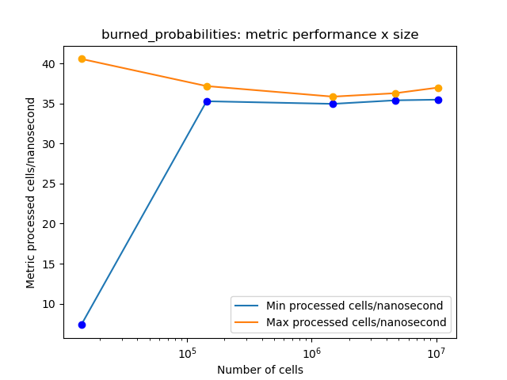

# Informe I

__Laboratorio__: fire_spread

__Integrantes__: Arroyo Joaquin y Bolzan Francisco

## Notas

Realizamos la optimización sobre la simuluación __burned_probabilities__.

## Métricas

__Celdas procesadas x nanosegundo__: Es escalable para diferentes tamaños de simulación y mayor valor indica mejor rendimiento.

__Otras métricas__: 

- __Porcentaje de _cache-misses___: Mide la frecuencia con la que los accesos a memoria fallan en la caché y requieren ir a RAM.
- ___IPC___: Representa la cantidad de instrucciones ejecutadas por ciclo de reloj. Un valor mayor sugiere un mejor aprovechamiento del procesador.

Para el cálculo de la primer métrica, contamos cada celda procesada por cada simulación y el tiempo que tardó, luego calculamos la métrica como ```processed_cells / (seconds * 1e7)``` y nos quedamos con el valor mínimo y máximo.

Para las otras dos métricas, utilizamos ```perf stat```.

## Optimización en g++

Tomamos un caso en particular de tamaño intermedio sobre el que aplicamos las siguientes optimizaciones:

```
-O1 + ffast-math -funroll-loops -fprefetch-loop-arrays -fstore-merging -freorder-functions
```

- __O1__: Bandera de múltiples mejoras que presenta mayor eficiencia.
- __fast-math__: Optimiza operaciones flotantes, impacto alto porque tenemos muchas operaciones con doubles.
- __unroll-loops__: Aplana loops en lo posible, impacto alto porque nuestros loops tienen condiciones predecibles.
- __prefetch-loop-arrays__: Precarga datos aser usados en loops, impacto medio porque nuestra estructura ppal es un arreglo que no entra en L1, L2.
- __store-merging__: Hace más eficiente el acceso a estructuras largas almacenadas, impacto medio porque nuestra estructura ppal es grande pero de ítems pequeños.
- __reorder-functions__: Reordena el código en memoria según su utilización, impacto medio porque condensa juntas las partes del código con mayor acceso a memoria.
- Quitamos __-march=native__ ya que las heurísticas que utiliza a veces chocan con aquellas de las otras banderas elegidas.
- Probamos las siguientes banderas sin notar mejora significativa: __-O2 -O3 -finline-functions -fhoist-adjacent-loads -mavx2 -mfma -funsafe-math-optimizations__.

## Otros compiladores

### clang

__COMPLETAR__

### icpx

Notamos que de base tuvo mejor rendimiento que g++, pero a medida que agregamos banderas esta diferencia pasaba a estar a favor de g++. Otro punto a notar, que no todas las banderas que utilizamos para g++ están disponibles en icpx.

## Resultados

### Gráficos



Observamos que, a medida que el tamaño aumenta, la métrica exhibe un comportamiento asintótico. Además, la diferencia entre la métrica mínima y la métrica máxima disminuye conforme el tamaño crece, lo que se debe a que el _system noise_ es más significativo en tamaños pequeños.


### Comparación

__Caso sin optimizar__

- Tiempo total: 56.5 segundos
- Celdas/Nanosegundo: 7.7 y 7.6
- cache-misses: 35.56%
- IPC: 1.78

__Caso optimizado__

- Tiempo total: 12.84 segundos
- Celdas/Nanosegundo: 34.2 y 32.0
- cache-misses: 26.20%
- IPC: 1.90

__Porcenaje de mejora final__

- 77.26%
- 321.05% y 344.16%
- 26.34%
- 6.74%

